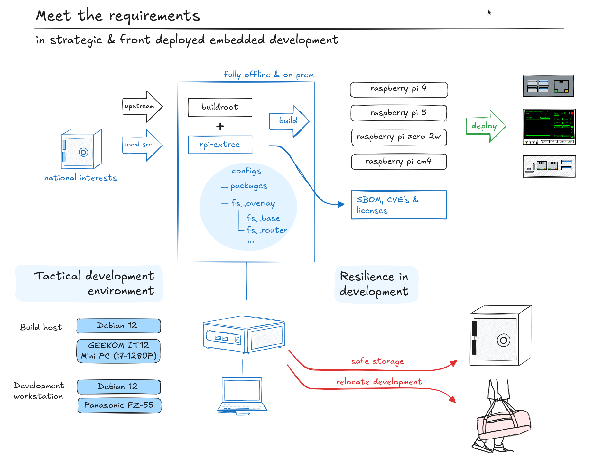

# External Buildroot Trees for Raspberry Pi

This project aims to unify external Buildroot trees for various Raspberry 
Pi hardware models and images. It is a work in progress designed to 
streamline the build environment across Edgemap and other related projects.

By consolidating configurations into a single, flexible environment, 
users can easily select the desired hardware targets and components for 
their builds. This approach leverages the official Raspberry Pi Foundation 
Linux kernel, ensuring compatibility and access to the latest kernel updates.

## Front-Deployed Development

This approach allows you to deploy embedded builds from any environment while 
retaining full control over source code and build processes. It ensures 
physical security of your development assets and, when necessary, enables 
rapid evasion or relocation—an essential capability if the development 
site comes under stress, surveillance, or physical threat.



### Equipments

- [Build host](https://www.geekompc.com/geekom-mini-it12-mini-pc/)
- [Panasonic FZ-55 development laptop](https://ruggedbooks.com/products/toughbook-fz-55-mk3-intel-core-i5-1345u-14-hd-16gb-512gb-ssd-windows-11-pro)
- [Debian](https://www.debian.org/distrib/)

## Buildroot configurations

Baseline configurations are:

```
raspberrypi4_64_defconfig
raspberrypi5_defconfig
raspberrypicm4io_64_defconfig
raspberrypizero2w_64_defconfig
```

## Kernel config

You can store and use custom kernel config with:

```
BR2_LINUX_KERNEL_CUSTOM_CONFIG_FILE="${BR2_EXTERNAL}/configs/kernel/bcm2711_defconfig"
```

## Filesystem overlays

By default filesystem overlay is defined to:

```
BR2_ROOTFS_OVERLAY="${BR2_EXTERNAL}/fs_overlay/fs_base"
```

You may change this based on your build.


