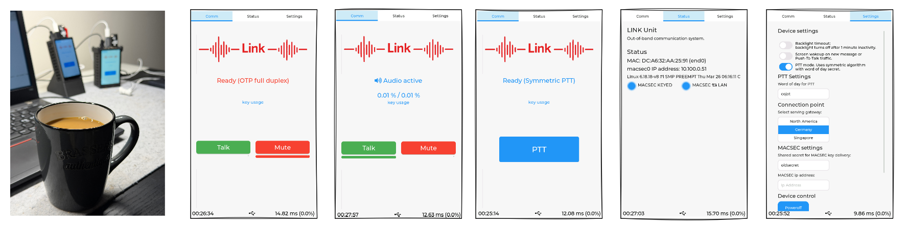
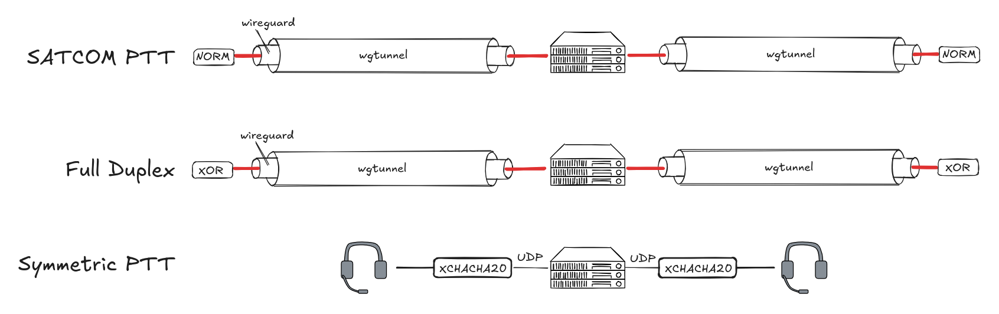

# Link

Link is open source resilience demonstration for communication with confidence. 



It's main purpose is to serve as training project for [critical thinking](https://resilience-theatre.com/wiki/doku.php?id=articles:cellular#mobiles)
and [dogma avoidance](https://www.thesalesblog.com/blog/how-to-avoid-having-your-beliefs-become-dogma). Project is based on knowledge, experience and mistakes.

## Features

* Suitable for small scale embedded SoC's (broadcom, rockchip, risc-v)
* Full source code available for on-prem building and modifications
* Buildroot supported [CycloneDX SBOM](https://buildroot.org/downloads/manual/manual.html#_generating_cyclonedx_sbom)
* Fully controlled server entity for connectivity between NAT'ed entities
* Server entity does not store communication content or presist data
* Functionality is fully ephemeral and point-to-point
* Three operating modes: Push-To-Talk (PTT), Full Duplex voice and SATCOM Push-To-Talk
* Three encryption examples: plain text, symmetric (XChaCha20) and logical XOR
* Speech compression with OPUS and CODEC2, depending the mode
* Capable to deliver two way speech communication via GEO satellite communication systems
* Can be used with [dark fiber](https://en.wikipedia.org/wiki/Dark_fibre) or twisted pair copper lines
* Training platform for crypto agility, onboard your implementation and train on platform threats
* User interface with [LVGL](https://lvgl.io/) on top of framebuffer
* Rekeying and configuration over separate [macsec](https://en.wikipedia.org/wiki/IEEE_802.1AE) LAN segment
* Utilizes several AI generated components
* Delivers maker skills approach to your [strategy](https://resilience-theatre.com/wiki/doku.php?id=link:introduction)

## Bill of materials, Rasbperry Pi

* [Raspberry Pi4](https://www.raspberrypi.com/products/raspberry-pi-4-model-b/)
* [Hyperpixel 4.0 display](https://shop.pimoroni.com/products/hyperpixel-4?variant=12569485443155)
* [Nitrokey 3A NFC](https://shop.nitrokey.com/shop/nk3an-nitrokey-3a-nfc-147)
* USB headset
* [Case 1](https://www.printables.com/model/689580-raspberry-pi-4-hyperpixel-40-standing-portrait-cas)
* [Case 2](https://www.printables.com/model/157791-hyperpixel-40-pi-4-case)
* [PiSugar](https://www.pisugar.com/) UPS (optional)

## Bill of materials, Rockchip

* [Vivid unit](https://www.vividunit.com)

## Bill of materials, RISC-V

* [VisionFive2](https://www.waveshare.com/wiki/VisionFive2)

## Operation modes



* Full duplex voice, codec2 with XOR secrecy
* Push-To-Talk with 'word of day' symmetric cipher (XChaCha20) using OPUS
* Push-To-Talk SATCOM using RFC 5740, [NACK-Oriented Reliable Multicast (NORM) protocol](https://www.nrl.navy.mil/Our-Work/Areas-of-Research/Information-Technology/NCS/NORM/) 

## Networking

* NAT circumvention with VPS as gateway
* Wireguard inside [wstunnel](https://github.com/erebe/wstunnel)
* XOR inside wireguard (on full duplex mode)

## Data at rest security

* LUKS2 encrypted data partition (or media) using [FIDO2 token](https://shop.nitrokey.com/shop/nk3an-nitrokey-3a-nfc-147)

## Prepare buildroot

Clone buildroot and rpi-extree repositories:

    git clone https://gitlab.com/buildroot.org/buildroot.git
    git clone https://codeberg.org/resiliencetheatre/rpi-extree.git

## Build

Build 'Link' image:
    
    cd builroot
	export BR2_EXTERNAL=[PATH]/rpi-extree
	make clean
	make raspberrypi4_64_com_hyperpixel_defconfig
	make

This first step builds image with libfido2 enabled. After initial build is
completed, you need to change `SYSTEMD_CONF_OPTS` at `package/systemd/systemd.mk`
to enable fido2 support for systemd. Change `-Dlibfido2=disabled` to `-Dlibfido2=enabled`
and rebuild systemd and full image. 

    make systemd-dirclean
    make systemd-rebuild
    make

Now you have image which have systemd with FIDO2 token support enabled.

## Create MicroSD card

	sudo dd if=output/images/sdcard.img of=[TARGET_DEVICE] status=progress

After card creation is completed, re-insert card and mount rootfs partition 
so that you could copy your ssh key to `/root/.ssh/authorized_keys`. With
this you are able to SSH as root to unit and take following steps.

# Configuration

Boot unit and login with SSH (keep FIDO2 token unplugged) and start by creating 
encrypted partition to your micro sd card:

```
buildroot:~# create-partition.sh 
[create-partition] Starting on /dev/mmcblk0
[create-partition] Closing old mappings and unmounting old filesystems if present
[create-partition] Partition 2 ends at sector 2162688
[create-partition] Creating partition 3 from 2164736s to 100%
[create-partition] Partition device is present: /dev/mmcblk0p3
[create-partition] Zeroing first 8 MiB of /dev/mmcblk0p3
[create-partition] About to DESTROY all data on /dev/mmcblk0p3 and create a new LUKS2 container

WARNING!
========
This will overwrite data on /dev/mmcblk0p3 irrevocably.

Are you sure? (Type 'yes' in capital letters): YES
Enter passphrase for /dev/mmcblk0p3: 
Verify passphrase: 
[create-partition] Opening LUKS container as internaldrive
Enter passphrase for /dev/mmcblk0p3: 
[create-partition] Zeroing first 8 MiB of /dev/mapper/internaldrive
[create-partition] Creating ext4 filesystem with label internaldrive on /dev/mapper/internaldrive
mke2fs 1.47.4 (6-Mar-2025)
Creating filesystem with 14996224 4k blocks and 3751936 inodes
Filesystem UUID: 0f49f271-bab1-48ad-9821-24fafc45fdd1
Superblock backups stored on blocks: 
	32768, 98304, 163840, 229376, 294912, 819200, 884736, 1605632, 2654208, 
	4096000, 7962624, 11239424

Allocating group tables: done                            
Writing inode tables: done                            
Creating journal (65536 blocks): done
Writing superblocks and filesystem accounting information: done   

[create-partition] Final LUKS status
/dev/mapper/internaldrive is active.
  type:    LUKS2
  cipher:  aes-xts-plain64
  keysize: 512 [bits]
  key location: keyring
  device:  /dev/mmcblk0p3
  sector size:  512 [bytes]
  offset:  32768 [512-byte units] (16777216 [bytes])
  size:    119969792 [512-byte units] (61424533504 [bytes])
  mode:    read/write
[create-partition] Final partition table
Model: SD SD64G (sd/mmc)
Disk /dev/mmcblk0: 122167296s
Sector size (logical/physical): 512B/512B
Partition Table: msdos
Disk Flags: 

Number  Start     End         Size        Type     File system  Flags
 1      1s        65536s      65536s      primary  fat16        boot, lba
 2      65537s    2162688s    2097152s    primary  ext4
 3      2164736s  122167295s  120002560s  primary

[create-partition] Done
[create-partition] Encrypted device: /dev/mmcblk0p3
[create-partition] Mapped device:    /dev/mapper/internaldrive
buildroot:~#
```

Note down password you entered. Keep fido2 token unplugged and reboot unit.

While keeping fido2 token unplugged, enroll fido2 token with script:

```
link:~# enroll-fido2.sh 
[enroll-fido2] Starting FIDO2 enrollment for /dev/mmcblk0p3
[enroll-fido2] Temporarily disabling udev rule /etc/udev/rules.d/99-nitrokey-luks.rules

Insert your FIDO2 token now.
When it is inserted and ready, press Enter to continue.

[enroll-fido2] Enrolling FIDO2 token to /dev/mmcblk0p3
🔐 Please enter current passphrase for disk /dev/mmcblk0p3: ••••••                  
Initializing FIDO2 credential on security token.
👆 (Hint: This might require confirmation of user presence on security token.)
Generating secret key on FIDO2 security token.
👆 In order to allow secret key generation, please confirm presence on security token.
New FIDO2 token enrolled as key slot 1.
[enroll-fido2] FIDO2 enrollment completed successfully
[enroll-fido2] Restoring udev rule /etc/udev/rules.d/99-nitrokey-luks.rules
[enroll-fido2] Done
link:~#
```

After fido2 token is enrolled, reboot by keeping fido2 token disconnected. Follow
instructions on screen after boot and insert fido2 token. After fido2 token is detected,
touch presence verification on token as instructed and while led on token is flashing.

Optional: After fido2 is enrolled, you may remove luks2 passphrase from luks headers.

## Connection configuration 

TBC


