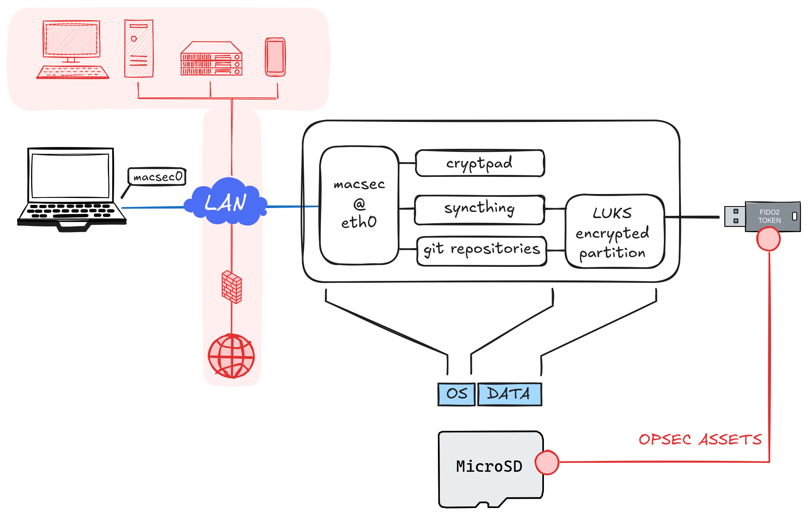
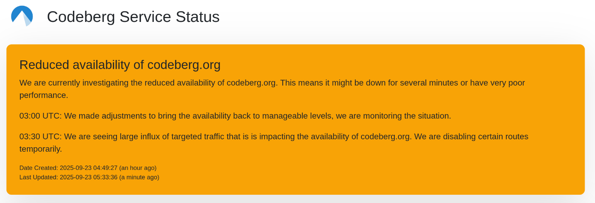

# Vault

Vault is a self-contained firmware for the Raspberry Pi 5 that turns it into a secure, always-on home for your code and documents.
It provides an encrypted MicroSD partition, unlocked at boot using a FIDO2 hardware token, and ships with **CryptPad**, **Syncthing**, and **Git** out of the box.
Optional extras like **Dokuwiki** can be installed under /usr/htdocs.

  

Vault is built with **Buildroot** as a dedicated firmware image. Its primary goal is to give you reliable, private storage on your own network 
segment—accessible only through a **MACsec-encrypted Layer 2 LAN interface**. This isolation ensures Vault cannot be reached from your regular LAN, eliminating lateral movement risks.


# Reasoning



The motivation behind Vault is simple: control and independence.

Relying on external services means inheriting their dependencies, policies, and risks. Geopolitics can affect availability, public source control platforms increase your exposure, and outsourcing trust to third parties is not always the wisest choice.

Vault exists to provide a **sustained, self-hosted, and physically-rooted alternative** - keeping your work in your hands, on your premises, and under your control.


# Building

Build 'vault' image:

	export BR2_EXTERNAL=[PATH]/rpi-extree
	make clean
	make raspberrypi5_vault_defconfig
	git apply ${BR2_EXTERNAL}/patches/buildroot/0001-go-linux-updates.patch
	make

After initial build is completed, enable fifo2 support for systemd and recompile.

	git apply ../rpi-extree/patches/buildroot/0002-systemd-fifo2.patch
	make systemd-dirclean; make systemd; make

Create MicroSD card

	sudo dd if=output/images/sdcard.img of=[TARGET_DEVICE] status=progress

Boot image and login with root using console cable. By defaul vault image does
not get ipv4 or ipv6 address on your LAN. Image has macsec (layer2) encryption
for networking and your host has to match for macsec keys to access vault via 
ipv4 macsec interface.

## Encrypted partition setup

You need FIDO2 hardware token, like Nitrokey for this functionality.

Create LUKS encrypted MicroSD partition with FIDO2 token for decryption. Plug in FIDO2 token and run
`create-partition.sh` script. Before reboot, activate `/etc/crypttab` and be prepared to press
user precense on token when token led blinks on boot. This will decrypt your luks partition with
fido2 token.

```
pivault:~# create-partition.sh 
Creating encrypted partition
WARNING: Device /dev/mmcblk0p3 already contains a 'crypto_LUKS' superblock signature.

WARNING!
========
This will overwrite data on /dev/mmcblk0p3 irrevocably.

Are you sure? (Type 'yes' in capital letters): YES
Enter passphrase for /dev/mmcblk0p3: 
Verify passphrase: 
Enrolling FIDO2 token to partitions:
/dev/mmcblk0p3
 
Be ready to press FIDO2 token, when LED is flashing...
 
🔐 Please enter current passphrase for disk /dev/mmcblk0p3: •••••••••••••••         
Initializing FIDO2 credential on security token.
👆 (Hint: This might require confirmation of user presence on security token.)
Generating secret key on FIDO2 security token.
👆 Got unsupported option error when user presence test is turned off. Trying with user presence test turned on.
New FIDO2 token enrolled as key slot 1.
LUKS open
Asking FIDO2 token for authentication.
👆 Please confirm presence on security token to unlock.
Creating filesystem
mke2fs 1.47.2 (1-Jan-2025)
Creating filesystem with 7011072 4k blocks and 1753088 inodes
Filesystem UUID: b72c1842-cc83-4fc6-a37a-e63afe88fac6
Superblock backups stored on blocks: 
	32768, 98304, 163840, 229376, 294912, 819200, 884736, 1605632, 2654208, 
	4096000

Allocating group tables: done                            
Writing inode tables: done                            
Creating journal (32768 blocks): done
Writing superblocks and filesystem accounting information: done   

# Activate crypttab
pivault:~# mv /etc/crypttab.notinuse /etc/crypttab
# reboot
pivault:~# reboot
```

## Setup macsec for your host

You need to enable macsec on your Linux host to complete steps bellow. Stay tuned for instructions.

## Initialize vault

	pivault:~# init-vault.sh [HOSTNAME]

Initialization script will output instructions how to setup Cryptpad installation:

	systemctl stop cryptpad 
	su cryptpad
	cd
	node server.js
	
	=============================
	Create your first admin account and customize your instance by visiting
	http://vault:3000/install/#952c6716fdf58eb62424f851173fb8bd06870dc0733f132c3e493df8f6ac39e4
	=============================

Finalize cryptpad installation on your browser. 

You can ignore The Lounge installation instructions, it's not built with vault image.

Reboot unit and remember to press FIDO2 presence if presence indication blinks during boot.

## Enable GIT user

Export your git ssh key to PUBKEY variable and create git user account for vault.

	vault:~# export PUBKEY="[YOUR_SSH_PUB_KEY]"
	vault:~# create-git-user.sh

Git user home directory is at encrypted MicroSD partition: `/opt/data/git`

## Setup syncthing

You need to create syncthing configuration before syncthing starts on boot.

	vault:~# su syncthing
	vault:/root$ cd
	# Generate configuration
	vault:/opt/syncthing$ syncthing generate
	2025-06-25 12:57:56 INF Generating key and certificate (cn=syncthing log.pkg=syncthing)
	2025-06-25 12:57:56 INF Calculated device ID (device=[YOUR_DEVICE_ID] log.pkg=github)
	# ctrl + d
	vault:~# reboot

Syncthing service runs `ExecStartPre=/bin/noupdates-syncthing.sh` which configures syncthing not
to update automatically, disables crash reporting and sets web ui listen address to macsec interface.

After reboot, you can finalize Synchting setup with browser at: http://vault:8384/

### Syncthing folder path

When configuring syncthing folders on vault, use path `/opt/data/synchting/` as root folder,
so for example `/opt/data/syncthing/Sync` is your path for default `Sync` folder from your PC.

`/opt/data/syncthing` is located on encrypted partition on MicroSD and owned by `syncthing` user.

 
# Using git 

You can use git-shell commands `list` and `create` to create and list repositories at vault.

	# Create repository to vault
	ssh git@vault create [project].git
	# List repositories at vault
	ssh git@vault list
	# Add remote and push
	git remote add vault git@vault:[project].git
	git push vault

All repositories are stored under `/opt/data/git` directory. This is encrypted partition
on your MicroSD and opened with FIDO2 token on boot. 


